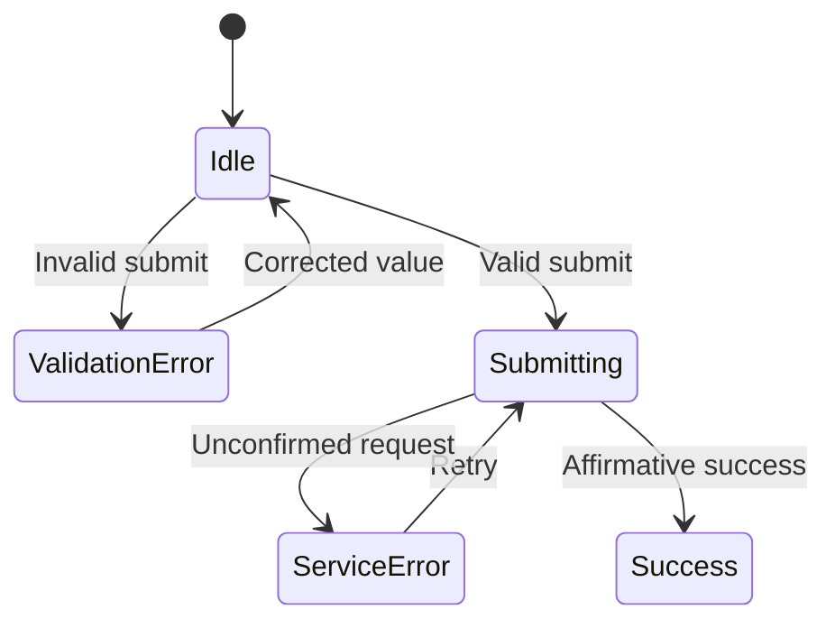

# Pod Request Access Landing Page — Implementation Plan

## Document status and inputs

- **Status:** Complete — Stage 6 adversarially challenged implementation plan
- **Last reviewed:** 2026-07-31
- **Figma source:** <https://www.figma.com/design/3QpvW7LouEu2K1bNwzICoD/pod-request-access-landing-page?node-id=102-145>
- **Selected node:** `102:145` — `🧪 Pod request access landing page`
- **Design definition:** [DESIGN.md](./DESIGN.md)
- **Product specification:** [SPEC.md](./SPEC.md)
- **Workflow record:** [WORKFLOW.md](./WORKFLOW.md)
- **Repository:** <https://github.com/ferfalcon/pod-request-access-landing-page>
- **Repository baseline:** `/workspace/scratch/f054d215a0d8/repo`
- **Branch:** `main`
- **Revision:** `f94f1045d3a4951abc9d4be52a37229874ae1350`

### Stage 5 decisions applied

The following user-approved decisions resolve the Stage 5 planning blockers:

1. Use content-fit transitions at `48rem` and `80rem`.
2. Treat the hero photograph as decorative.
3. Use a `3px` white focus ring with a `3px` offset; a dark inset edge and reduced shadow for the pressed CTA; “Requesting…” during submission; “We couldn’t submit your request. Please try again.” for service failure; and “Thanks! Your request has been received.” for success.
4. Target Vite 8’s `baseline-widely-available` 2026-01-01 browser baseline—Chrome `111+`, Edge `111+`, Firefox `114+`, and Safari `16.4+`—for core behavior. Use newer features only as progressive enhancements.

Asset/content approval and the production request-service/privacy contract remain release gates, not blockers to planning the page and its testable UI states.

These approved decisions resolve the corresponding Stage 4 open questions for implementation planning. `DESIGN.md` and `SPEC.md` remain the reconciled Stage 4 snapshots; this plan and `WORKFLOW.md` are the authoritative records of the later Stage 5 resolutions.

### Stage 6 challenge result

The adversarial review retained the vanilla Vite/TypeScript direction but corrected several assumptions that would otherwise make the plan unsafe or unverifiable:

1. **Early phases are construction states, not release candidates.** Phases 1–2 must not be deployed as a public request form before the controller and fail-closed service selection exist.
2. **Behavior tests arrive with behavior.** Minimal Vitest/DOM tooling moves into Phase 3 so that phase can prove its own state transitions; Phase 4 adds browser, accessibility-smoke, and CI coverage.
3. **Custom validation takes ownership only after initialization.** Raw HTML keeps native constraints. The controller sets `form.noValidate = true` only after it is ready to synchronize visible and programmatic feedback.
4. **Production previews fail closed.** Test-only success/failure fakes never enter a production bundle. Until the real service contract is approved, the shipped adapter rejects to the recoverable service-error state and sends no email.
5. **A static-only production architecture is conditional.** If the approved service needs secrets, same-origin HTML fallback, rate limiting, or a CORS boundary, Phase 5 must add or connect a server-side/edge request boundary instead of exposing credentials or weakening security.
6. **Announcement ownership is explicit.** Validation is conveyed through field association plus focus; asynchronous progress/failure uses one polite status channel; success uses focused confirmation. The same message must not be announced through two paths.
7. **Compatibility and performance claims require evidence.** Current Playwright browsers do not prove the approved minimum browser versions, and the hero must not receive high fetch priority unless measurement identifies it as the LCP candidate.
8. **Repository and asset drift are gated.** The legacy README’s different empty-email message must be removed, and the supplied `1x` hero crops cannot be treated as approved high-density production assets.

## Repository baseline

### Runtime and toolchain

| Area | Current repository state |
|---|---|
| Runtime | No checked-in Node version. The verified environment used Node `24.14.0`; Vite 8 requires Node `^20.19.0 \|\| >=22.12.0`. |
| Package manager | pnpm lockfile version `9.0`; verified with pnpm `11.7.0`. |
| Build tool | Vite `8.1.5`. |
| Language | TypeScript `6.0.3`, ES modules. |
| Browser build target | Vite 8 default `baseline-widely-available`, approved for this project. |
| Framework | None. This is a vanilla HTML/CSS/TypeScript project. |

The current commands are:

```bash
pnpm install --frozen-lockfile
pnpm run dev
pnpm run build
pnpm run preview
```

`pnpm run build` currently runs `tsc && vite build` and passes on the recorded baseline.

Phase 1 should select one Vite-compatible Node line for local, CI, and Vercel use and record it through the repository’s chosen runtime file plus `engines`. Add `packageManager` with an exact pnpm semantic version—not a range—so Corepack and pnpm do not disagree about the manifest contract.

### Project structure and architecture

- `frontend/` is the deployable Vite application.
- `frontend/index.html` contains only the generated Vite mount point.
- `frontend/src/main.ts`, `counter.ts`, and `style.css` are the unmodified Vite starter.
- The current application renders all markup from a TypeScript template string and has no feature or domain boundaries.
- There are no routes, application components, service modules, state model, API client, environment contract, or persisted data.
- `frontend/tsconfig.json` enables bundler resolution, `noEmit`, `verbatimModuleSyntax`, `noUnusedLocals`, `noUnusedParameters`, and `noFallthroughCasesInSwitch`.

### Reusable material

`docs/starter-code/` contains reusable source material:

- Pod logo and four platform SVGs.
- Decorative dot-pattern SVG.
- Responsive hero JPEG crops:
  - `image-host-s.jpg` — `375 × 667`
  - `image-host-m.jpg` — `491 × 767`
  - `image-host-l.jpg` — `888 × 640`
- `32 × 32` favicon.
- Minimal semantic copy and a partial token-oriented CSS seed.

The starter CSS is reference material, not production-ready styling. Its palette and weight tokens are useful, but it lacks layout, states, accessibility, responsive behavior, and complete typography.

### Quality, configuration, and deployment

- There are no unit, integration, browser, accessibility, or visual-regression tests.
- There is no lint command or lint configuration.
- TypeScript checks are coupled to the production build rather than exposed as a separate command.
- There is no `.env.example`, request-service endpoint, response contract, or error-normalization boundary.
- There is no CI workflow.
- The README links to a Vercel deployment, but the repository does not record the Vercel project root, build command, output directory, environment variables, or rollback procedure.
- The README still specifies “Oops! Please add your email” for an empty submission, which conflicts with the reconciled single validation message “Oops! Please check your email” in `FR-006` and `CONTENT-001`.
- The checkout was clean after the verified install and build.

### Repository constraints

The repository-local Modern Web Guidance requires the implementation to:

- Prefer native semantic HTML and controls.
- Keep visual validation and programmatic invalid state synchronized.
- Avoid showing validation errors before the approved submission attempt.
- Preserve logical DOM and focus order across responsive layouts.
- Use intrinsic, overflow-resilient CSS rather than fixed sample-frame heights.
- Provide explicit focus visibility and accessible dynamic-state announcements.
- Treat features newer than the approved browser baseline as progressive enhancements.
- Optimize above-the-fold imagery and fonts without adding unnecessary client-side work.

## Implementation strategy

### 1. Preserve the vanilla Vite architecture

Keep the current Vite/TypeScript stack. The page has one view, one form, and a small state machine; adding React or another framework would increase bundle size and architectural surface without solving a repository or product need.

Place the essential page structure directly in `frontend/index.html` so the brand, heading, supporting copy, form, and decorative imagery are available before TypeScript executes. Use `frontend/src/main.ts` only to load styles and initialize progressive behavior.

### 2. Organize by page foundation and request-access feature

Use a small feature boundary:

- Static semantic document and content in `index.html`.
- Design tokens and layout styles in focused CSS files.
- Request form validation, state transitions, and DOM synchronization under `src/request-access/`.
- A service port that isolates the UI from the still-unknown production API contract.

This keeps the behavior testable without introducing a general component framework or application-wide state store.

### 3. Use the web platform for form semantics

The form should use:

- `<form>`, `<label>`, `<input type="email">`, and `<button type="submit">`.
- `name="email"`, `required`, `autocomplete="email"`, `inputmode="email"`, and a persistent programmatic label.
- Native `ValidityState`/`checkValidity()` for standard one-address syntax after trimming.
- One submit handler for both Enter and CTA activation.
- Explicit controller state for validation visibility, submitting, service error, and success.

Do not rely only on `:invalid` or `:user-invalid`. Those selectors cannot by themselves express the approved “first validate on submit, clear once corrected, do not immediately restore” rule across the full browser target. Synchronize a controller-owned state with `aria-invalid`, the visible feedback element, and CSS state hooks.

Keep native constraints active in the raw document. After the controller has resolved every required element and attached its handlers, it should set `form.noValidate = true`; this allows the single submit path to own validation without letting a partially initialized script suppress browser behavior. If controller initialization fails, native constraint validation remains available.

Use `method="post"` for the final mutation. If the custom UI suppresses the browser’s default validation bubble, it must still use the native constraint API and the receiving service must validate independently. The production `action` and no-JavaScript response cannot be finalized until the request endpoint and response contract are approved. Do not invent a destination during UI-only phases, and do not treat Phases 1–2 as publicly deployable form releases.

Before production, Phase 5 must choose and verify one progressive-enhancement contract:

- A real same-origin or CORS-compatible HTML form action that accepts the email and returns an accessible success/error response when JavaScript is unavailable; or
- A same-origin server-side/edge boundary that provides that form action and delegates safely to the approved service.

If neither is available, production release remains blocked. A `<noscript>` notice may explain an outage or limitation but is not a substitute for an approved submission path.

### 4. Keep UI state explicit and finite

Model request state as a discriminated union or equivalent finite state:

```text
idle | validation-error | submitting | service-error | success
```

Populated, autofill, hover, pressed, and focus are independent control presentations. They should be expressed by the input value, browser behavior, and CSS pseudo-classes rather than added as request outcomes.



During submission:

- Snapshot the normalized email being submitted.
- Change the CTA label to “Requesting…”.
- Guard the handler against a second pending request.
- Keep the CTA focusable, expose `aria-disabled="true"`, and enforce the guard in the submit handler rather than relying on a native `disabled` state that may remove the active control from the focus sequence.
- Make the email value read-only rather than removing it from the submitted/request context.
- Expose busy/progress state through the form’s busy state and one polite status channel.
- Keep the form’s geometry stable.

Every exit from `submitting` must restore the input’s editability and CTA availability before failure feedback is exposed. A controller teardown or stale result must not leave the visible form permanently read-only.

### Announcement ownership

Use separate, non-duplicating channels:

- **Validation error:** Update the visible error, field association, and `aria-invalid` together, then focus the field. Do not mirror the same validation text into the asynchronous live-status region.
- **Submitting and service error:** Keep focus stable and update one persistent polite status region. A service failure is a form/request outcome, not an email-validity error: do not set `aria-invalid` or field error semantics unless the current value independently fails local validation.
- **Success:** Replace the form slot and move focus to the confirmation with `tabindex="-1"`. Clear the live status before focusing the confirmation so the same success text is not announced twice.

Representative screen-reader/browser checks decide whether `aria-errormessage` can be used in addition to or instead of `aria-describedby`; the minimum contract is a broadly supported association with one announcement path.

### 5. Isolate the production service contract

Define a narrow `RequestAccessService` port that accepts one normalized email and resolves only on affirmative success. Network failures, timeouts, non-success responses, malformed responses, and missing configuration must all reject into the recoverable service-error state.

Unit and browser tests may inject deterministic success, failure, timeout, stale-response, and deferred fakes. Those fakes must live in test-only modules or fixtures that production entry points cannot import. Until the real adapter is approved, the production bootstrap uses an unavailable adapter that rejects without transmitting the email; this allows the recoverable UI to be reviewed without fabricating receipt.

The real HTTP adapter, request shape, response recognition, timeout policy, CORS/CSRF behavior, abuse protection, and environment variable belong to the release-integration phase after the service and privacy requirements are approved. The receiving boundary must revalidate and normalize the email, rate-limit abuse, avoid logging the raw address unnecessarily, and keep secrets out of all `VITE_*` variables and client bundles.

Phase 5 must decide the deployment topology from the approved service:

| Service condition | Required topology |
|---|---|
| Public browser-safe endpoint, approved CORS, no client secret, and an HTML-compatible fallback | Direct client adapter may be used. |
| Secret, privileged credential, incompatible CORS, required rate limiting, or no suitable HTML response | Add or connect a same-origin server-side/edge request boundary. |
| Neither topology is approved and testable | Keep the fail-closed adapter and block production release. |

### 6. Use mobile-first, content-fit CSS

Use three layout modes:

| Mode | Width range | Intended composition |
|---|---|---|
| Mobile | Below `48rem` | Centered single column; subdued full-page hero; marks visually before form; stacked controls; no dots. |
| Tablet-like | `48rem` to below `80rem` | Left-aligned overlapping content/image composition; inline form; marks after form; tall hero crop; dots visible. |
| Desktop | `80rem` and above | Centered `70rem`/`1120px` maximum composition; wide hero crop; overlapping content panel; dots visible. |

Use `@media (min-width: 48rem)` and `@media (min-width: 80rem)`. Keep the root font size at the browser default so the breakpoints respond correctly to user settings.

Use CSS Grid for the page-level content/image relationship and Flexbox only for one-dimensional groups such as platform marks. Prefer logical properties, flexible tracks, `min-inline-size: 0`, `max-inline-size`, `min-block-size`, and normal document flow. Do not use a fixed viewport height or hide overflow to reproduce the sample frames.

The semantic DOM order should remain brand, heading, supporting copy, form, and decorative marks. CSS may visually place the marks before the form on mobile because the marks are non-interactive and hidden from the accessibility tree; no interactive item may be visually reordered away from its focus order.

### 7. Treat imagery as decorative but performance-relevant

- Render the hero as a decorative `<picture>`/`` layer with the three supplied crops selected by media source.
- Keep it in raw HTML so the browser can discover the above-the-fold resource without waiting for TypeScript.
- Use explicit intrinsic dimensions or an aspect-ratio-bearing wrapper to prevent layout shift.
- Keep eager loading for the above-the-fold hero. Measure the built page before assigning `fetchpriority="high"` or adding a preload; use either only if the hero is the measured LCP candidate, because an unnecessary high-priority decorative image can compete with CSS and fonts. Treat fetch priority as progressive enhancement.
- Apply crop, opacity, and tint in CSS without reducing foreground contrast.
- Render dots and platform marks with empty alternative text, hide the decorative mark group from the accessibility tree, and provide no interactive wrapper.
- Copy approved assets into the Vite source tree so production assets receive hashed build URLs.

The supplied hero JPEGs are single-density crops (`375 × 667`, `491 × 767`, and `888 × 640`). Use them for structural development and reference comparison, but do not invent upscaled derivatives. Final asset approval must either confirm that these are acceptable at tested device pixel ratios or provide higher-density/modern-format sources; re-run crop, byte-size, LCP, and visual checks after replacement.

Chivo is not present in the repository. Obtain approved, licensed WOFF2 files for weights `300` and `700` and self-host them. Avoid adding a Google Fonts request while privacy requirements remain unresolved. Use `font-display: swap` and a measured system fallback; `font-size-adjust` may be a progressive enhancement but cannot be required for the approved minimum browser set.

## Requirement-to-implementation mapping

All paths marked **proposed** do not exist at the repository baseline.

| Requirement | Responsible implementation area | Verification focus |
|---|---|---|
| `FR-001` | `frontend/index.html`; `src/styles/page.css` (proposed) | One complete initial experience is present before behavior initializes. |
| `FR-002` | Semantic form in `frontend/index.html` | One editable email control and one submit button named “Request Access”. |
| `FR-003` | `src/request-access/controller.ts` (proposed) | Form `submit` event handles Enter, pointer, and touch through the same path. |
| `FR-004` | `src/request-access/validation.ts` (proposed) | Trimmed value uses native one-email syntax without provider-specific rules. |
| `FR-005` | `controller.ts`; initial markup/CSS state | No local error before a submit attempt. |
| `FR-006` | `controller.ts`; `src/styles/request-form.css` (proposed) | Invalid request is blocked; value, outline, and exact observed copy remain. |
| `FR-007` | `controller.ts` input/change handling | A corrected valid value clears the error; later invalid editing does not restore it. |
| `FR-008` | `controller.ts`; request state model | One guarded request, retained email, focusable `aria-disabled` CTA, stable “Requesting…” state, and complete restoration on every failure exit. |
| `FR-009` | `controller.ts`; `RequestAccessService` port (proposed) | Only affirmative success replaces the form with inline confirmation. |
| `FR-010` | `controller.ts`; service error normalization | Form and email return with exact recoverable service-error copy. |
| `FR-011` | `controller.ts` retry transition | Retry and edit-before-retry reuse the normal validation/submission path. |
| `FR-012` | `request-form.css`; controller-owned request state | Autofill, value, hover, pressed, focus, invalid, and submitting remain independent. |
| `FR-013` | Platform-mark markup in `index.html` | No anchors, buttons, listeners, or focus stops. |
| `CONTENT-001` | `index.html`; feedback constants in `controller.ts` | Observed initial and validation copy is exact. |
| `CONTENT-002` | `index.html`; copied platform SVG assets | Four marks remain in the observed order until approved content changes. |
| `CONTENT-003` | `controller.ts` feedback constants | Exact approved service-error and success messages are used. |
| `RESP-001` | `src/styles/page.css` desktop mode | `1440px` matches the constrained, overlapping desktop composition. |
| `RESP-002` | `page.css` tablet-like mode | `768px` retains left alignment, inline form, overlap, and marks-after-form. |
| `RESP-003` | Mobile-first `page.css` and `request-form.css` | `375px` uses centered flow, subdued image, marks-before-form, and stacked controls. |
| `RESP-004` | Intrinsic CSS plus `48rem`/`80rem` transitions | No collision, clipping, or page-level horizontal scroll at intermediate widths. |
| `RESP-005` | Responsive hero `<picture>` and image-layer CSS | Correct crop without distortion or reduced foreground operability. |
| `RESP-006` | Normal-flow page/form feedback; no fixed page height | Long copy, feedback, short viewports, and keyboard allow vertical scrolling. |
| `RESP-007` | Desktop wrapper `max-inline-size: 70rem` | Composition remains centered and bounded above the reference width. |
| `A11Y-001` | `main`, `h1`, `form`, and native controls in `index.html` | Landmarks, heading, form, and submit semantics are exposed. |
| `A11Y-002` | One `h1` with presentational spans | Color split preserves one accessible name and reading order. |
| `A11Y-003` | Persistent `<label>` in `index.html` | Placeholder/prompt is not the only label. |
| `A11Y-004` | Email input attributes | Email purpose, autocomplete, single-address behavior, and mobile keyboard support. |
| `A11Y-005` | Native submit button and form submit handler | No keyboard trap; Enter and CTA activation are equivalent. |
| `A11Y-006` | `request-form.css` focus-visible/focus-within rules | Approved `3px` white ring and `3px` offset remain distinct from hover. |
| `A11Y-007` | DOM structure plus decorative mark treatment | Logical reading/focus order is stable in every mode. |
| `A11Y-008` | `controller.ts`; persistent feedback element | `aria-invalid`, error association, announcement, text cue, and value preservation. |
| `A11Y-009` | Owned validation/status/success announcement paths | Submitting, failure, and success are communicated exactly once; success confirmation receives focus. |
| `A11Y-010` | Platform images with empty alt and no control wrapper | Marks are absent from the accessibility tree and focus order. |
| `A11Y-011` | Empty-alt hero and dot assets | Approved decorative hero and dots expose no redundant text. |
| `A11Y-012` | Design tokens; automated/manual contrast checks | Text, control boundary, and focus-indicator ratios meet the specification. |
| `A11Y-013` | Intrinsic layout, fluid widths, overflow checks | `200%` text size and `400%`-equivalent reflow retain all operation. |
| `A11Y-014` | Form control size tokens | Field and CTA keep at least `44px` block size. |
| `A11Y-015` | No required motion; reduced-motion guard for any later transition | Status remains immediate and nonessential motion is removed when requested. |

## Architecture and data flow

### Ownership boundaries

| Boundary | Responsibility |
|---|---|
| Document (`index.html`) | Semantic content, stable form structure, asset references, persistent feedback/status containers. |
| Presentation (`src/styles/`) | Tokens, reset/base styles, three responsive layout modes, control states, decorative layering. |
| Validation (`validation.ts`) | Trim and evaluate one email using native validity semantics; no service or DOM ownership. |
| Controller (`controller.ts`) | Read/write form state, guard transitions, synchronize DOM and ARIA, preserve values, focus feedback. |
| Service port (`service.ts`) | One asynchronous request abstraction; success only on an affirmative result. |
| Unavailable adapter | Production-safe pre-integration default; transmits nothing and rejects into recoverable failure. |
| HTTP adapter (proposed, gated) | Production endpoint, method, headers, payload, timeout, and response mapping after contract approval. |
| Server-side/edge boundary (conditional) | Same-origin form action, secret isolation, service delegation, server validation, and abuse protection when a direct browser adapter is unsafe or incomplete. |

### Submission flow

1. The initialized controller enables its custom-validation ownership by setting `form.noValidate = true`; without successful initialization, raw HTML retains native constraints.
2. The native form emits `submit`, and the controller prevents navigation only when progressive TypeScript behavior is active.
3. If a request is already pending, the controller exits without starting another.
4. The validation module trims the value and evaluates empty/email validity.
5. Invalid input updates visual feedback, ARIA state, and focus without calling the service.
6. Valid input enters `submitting`, snapshots the normalized email, exposes progress, and calls the injected service.
7. Affirmative success transitions to `success`, replaces the form slot, announces confirmation, and focuses the confirmation.
8. Any unconfirmed outcome transitions to `service-error`, restores the operable form, preserves the email, announces the error, and permits retry.

The controller must ignore or abort a late response after teardown and must prevent stale responses from overwriting a newer state. An `AbortController` may be added with the production adapter if the service contract supports cancellation; it is not required for the initial single-request UI.

## File and module impact

| Path or area | Existing or proposed | Planned responsibility |
|---|---|---|
| `frontend/index.html` | Existing; replace starter markup | Complete semantic page, responsive picture sources, logo/marks, form, feedback/status slots, metadata, favicon. |
| `frontend/src/main.ts` | Existing; replace starter bootstrap | Import styles and initialize the request-access controller with the configured service. |
| `frontend/src/counter.ts` | Existing; remove | Delete unused Vite demo behavior. |
| `frontend/src/style.css` | Existing; replace or retire | Replace the monolithic demo stylesheet with focused imports or remove after split styles are active. |
| `frontend/src/styles/tokens.css` | Proposed | Colors, typography, spacing, sizes, radii, elevation, and layout custom properties. |
| `frontend/src/styles/base.css` | Proposed | Minimal reset, box sizing, body defaults, visually-hidden utility, font faces. |
| `frontend/src/styles/page.css` | Proposed | Page shell, content/image overlap, three layout modes, logo, copy, hero, marks, dots. |
| `frontend/src/styles/request-form.css` | Proposed | Inline/stacked form layouts and independent hover, pressed, focus, invalid, busy, error, and success treatments. |
| `frontend/src/request-access/controller.ts` | Proposed | UI state machine, events, ARIA synchronization, focus, feedback, submission guard. |
| `frontend/src/request-access/validation.ts` | Proposed | Email normalization and standard validity evaluation. |
| `frontend/src/request-access/service.ts` | Proposed | Service interface, result/error types, and configuration boundary. |
| `frontend/src/request-access/unavailable-service.ts` | Proposed | Fail-closed production default before real integration; transmits nothing and always returns a recoverable failure. |
| `frontend/src/request-access/http-service.ts` | Proposed; release-gated | Real request adapter after API/privacy approval. |
| Same-origin server/edge request area | Conditional and release-gated | Required only when secrets, CORS, abuse protection, or HTML fallback make a browser-only adapter insufficient; choose its path after Vercel/service topology is confirmed. |
| `frontend/src/assets/images/` | Proposed destination | Approved copies of the logo, marks, dots, and three hero crops from `docs/starter-code/`. |
| `frontend/src/assets/fonts/` | Proposed; asset-gated | Approved self-hosted Chivo `300` and `700` WOFF2 files. |
| `frontend/src/request-access/*.test.ts` | Proposed | Validation and controller-state tests with injected service fakes. |
| `frontend/tests/request-access.spec.ts` | Proposed | Browser journey, keyboard, announcement, retry, and duplicate-submission checks. |
| `frontend/tests/responsive.spec.ts` | Proposed | Reference and intermediate-width layout/overflow checks. |
| `frontend/vitest.config.ts` | Proposed | DOM-capable unit/integration test setup. |
| `frontend/playwright.config.ts` | Proposed | Chromium, Firefox, and WebKit browser checks and local Vite server. |
| `frontend/eslint.config.js` | Proposed | Minimal flat ESLint configuration for browser TypeScript. |
| `frontend/.env.example` | Proposed; service-gated | Document the approved public endpoint/configuration names without secrets. |
| `frontend/package.json` and lockfile | Existing; update | Add explicit quality scripts, test/lint tooling, and a reproducible package-manager/runtime contract. |
| Repository runtime-version file | Proposed | Pin the Vite-compatible Node line chosen for local, CI, and Vercel use; select the repository’s convention during Phase 1. |
| Vite demo assets under `frontend/src/assets/` and `frontend/public/` | Existing; remove when unreferenced | Remove `hero.png`, Vite/TypeScript marks, demo icons, and the starter favicon after replacement so dead starter material does not survive the migration. |
| `README.md` | Existing; update | Local commands, architecture summary, asset/service prerequisites, Vercel settings, verification, release gates, and replacement of the conflicting legacy empty-email message. |
| `.github/workflows/ci.yml` | Proposed | Install, lint, type-check, test, and build on pull requests/pushes after tooling lands. |

## UI, styling, assets, and content

### Design tokens

Translate the reconciled values into semantic custom properties rather than scattering raw values:

- Color roles: page, surface, field, body text, muted marks, accent, strong text, error.
- Typography roles: heading, body, control, feedback; Chivo weights `300` and `700`.
- Spacing scale: `0.25rem` through `6.5rem`, preserving the observed `4–104px` values at the default root size.
- Layout: `70rem` principal maximum, `28rem` copy/form measure, mobile/tablet/desktop outer spacing, `44px` minimum controls.
- State: focus width/offset, invalid outline, CTA shadow/inset edge.

Use component-specific custom properties only when a value is intentionally local. Do not turn every one-off measurement into a global token.

### Page composition

- Build the larger tablet/desktop composition with named CSS grid areas for logo, content, hero, and dots.
- Keep the content panel above the decorative image through a small, documented stacking context.
- Use a single content/form DOM, not duplicate mobile and desktop markup.
- Limit the desktop wrapper to `70rem`; use fluid inline padding below that width.
- Use `min-block-size`, not a fixed height. Center vertically only when spare space exists; never make centering a prerequisite for content access.

### Form state styling

- Default field: Blue 900 surface, readable prompt/value, pill geometry.
- Populated/autofill: maintain readable value and field boundary without implying validity.
- Hover: apply the observed lighter green treatment only to an enabled CTA on hover-capable pointers.
- Pressed: add the approved dark inset edge and reduce the outer shadow.
- Focus: approved `3px` white outer ring with `3px` offset; keep it visible for both field and CTA and separate from hover.
- Invalid: `2px` error-red outline plus observed error text in normal flow.
- Submitting: stable button dimensions, “Requesting…” label, focusable `aria-disabled` state, guarded activation, and one busy announcement.
- Service error: preserve form and email; show exact approved message in the normal feedback region.
- Success: replace the complete form slot with “Thanks! Your request has been received.” and a programmatically focusable confirmation.

The Figma control copy uses `14px`, but mobile Safari may enlarge a focused input when its computed text is below `16px`. Test the real input on iOS. If unintended viewport zoom disrupts reachability, use a `1rem` input value on the affected narrow/touch layout and record the small fidelity deviation rather than suppressing user zoom.

### Content and asset policy

- Keep all current observed copy until approved replacements exist.
- Treat the hero, dot pattern, and platform marks as decorative.
- Preserve platform order and visible marks for design fidelity, but do not rely on them to communicate information.
- Confirm the outdated Google Podcasts reference, logo licenses, hero-photo license, and Chivo delivery before release.
- Do not fetch fonts or assets from third parties at runtime without an approved privacy decision.

## Accessibility plan

1. Use native landmarks, one `h1`, a real form, a persistent label, an email input, and a submit button.
2. Keep heading color spans presentational inside one heading.
3. Keep one logical DOM/focus order; reposition only non-interactive, accessibility-hidden marks.
4. Set validation feedback through one controller operation that updates visible text, `aria-invalid`, and the description/error association together.
5. Focus the invalid field after an invalid submission; do not duplicate the validation message in the asynchronous live-status region.
6. Expose submitting with `aria-busy`, a focusable `aria-disabled` CTA, and one polite status update while preserving the CTA’s accessible purpose.
7. On service error, restore operability first, retain focus predictably, and announce retry availability once without moving the user unexpectedly.
8. On success, clear stale live status, move focus to the inline confirmation with `tabindex="-1"`, and avoid a second equivalent announcement.
9. Keep decorative images empty-alt and non-focusable; avoid redundant `aria-label` values on platform SVGs.
10. Test pointer, touch, keyboard, screen-reader announcements, autofill, `200%` text resize, `400%`-equivalent reflow, high zoom, short viewports, and reduced motion.
11. Verify the approved white focus ring and all text/control boundaries against their adjacent colors.

## Testing and verification strategy

### Proposed tooling

- **Vitest + a DOM environment:** validation, state transitions, duplicate guard, retry, value preservation, and service result normalization.
- **Testing Library DOM helpers:** query and interact through accessible names and roles rather than implementation selectors.
- **Playwright:** Chromium, Firefox, and WebKit journeys; responsive widths; keyboard operation; no-horizontal-overflow assertions; screenshots for review.
- **axe-core integration:** automated accessibility smoke checks, supplemented by manual verification.
- **ESLint:** browser TypeScript correctness and maintainability.

Keep dependencies development-only. Avoid a visual-regression platform or component framework unless later project scale justifies one.

### Unit and DOM integration coverage

- Trimming and standard email validation.
- No error before first submit.
- Empty/invalid submit and exact validation copy.
- Error clearing only when a previously invalid value becomes valid.
- Autofill/change event synchronization.
- Valid submit enters one pending request and guards repeats.
- Affirmative success only; malformed/missing responses fail closed.
- Network/service failure preserves the value and allows edit/retry.
- Missing configuration uses the unavailable adapter, sends no request, and produces recoverable failure.
- Timeout rejection, teardown, and stale/late completion cannot overwrite a newer state or leave controls locked.
- Controller initialization failure does not set `noValidate` and does not partially attach behavior.
- Independent CTA/field states.
- Focus and ARIA updates for invalid, busy, service-error, and success transitions.

### Browser and responsive coverage

Test at minimum:

- `320px`, `375px`, `479px`, `767px`, `768px`, `1024px`, `1279px`, `1280px`, `1440px`, and a width above `1440px`.
- Short mobile viewport and landscape orientation.
- Mobile virtual-keyboard interaction where device testing is available.
- Real-iOS verification of input focus zoom; if `14px` causes disruptive automatic zoom, verify the documented `1rem` narrow-layout adjustment.
- Long email values and longer feedback/copy fixtures.
- `200%` text size and `400%`-equivalent reflow.
- Current stable Chromium, Firefox, and WebKit in automation; a real Safari check before release.
- A documented compatibility audit for every core API, selector, and attribute against Chrome `111+`, Edge `111+`, Firefox `114+`, and Safari `16.4+`. Current Playwright binaries do not prove those minimums; use available real/remote minimum-version smoke tests or keep the implementation within verified older capabilities.
- Any feature newer than the approved baseline must have a verified fallback or remain nonessential.

Reference screenshots at `375 × 812`, `768 × 1024`, and `1440 × 960` should be compared with the Figma frames. Intermediate-width assertions should prioritize collision/overflow and hierarchy rather than pixel matching.

### Quality commands after tooling is added

```bash
pnpm run lint
pnpm run typecheck
pnpm run test
pnpm run test:e2e
pnpm run build
```

The existing `pnpm run build` remains the baseline gate until the additional scripts are introduced.

### Manual checks

- Screen-reader pass for label, error, busy, service-error, and success announcements.
- Keyboard-only pass for focus visibility, Enter submission, retry, and no traps.
- Browser autofill readability and validation synchronization.
- Contrast verification for normal/large text, boundaries, and focus.
- Touch target and virtual-keyboard reachability.
- Asset crop, tint, and visual fidelity at all three reference frames.
- Page behavior with JavaScript/service configuration unavailable; it must not claim a successful request.
- No-JavaScript production submission through the approved form action and accessible HTML response.
- Production bundle inspection confirming that test success fakes, secrets, and raw-email logging are absent.

## Phase roadmap

### Phase 1 — Foundation and semantic page

- **Objective:** Replace the Vite demo with the semantic Pod page, approved assets, design tokens, and reproducible project scripts.
- **Included requirements:** `FR-001`, `FR-002`, `FR-013`, `CONTENT-001`, `CONTENT-002`, `A11Y-001`–`A11Y-004`, `A11Y-010`, `A11Y-011`.
- **Dependencies:** Approved Stage 5 decisions; usable starter assets.
- **Deliverable:** Static, meaningful construction state with no Vite demo residue; it is not a release candidate and must not be deployed as a public request form.
- **Verification gate:** Type-check/build pass; landmarks, heading, label, controls, content, and decorative semantics inspect correctly; the conflicting README validation copy is removed; the runtime and exact package-manager version contract is valid.

### Phase 2 — Responsive visual system

- **Objective:** Implement the three content-fit modes, imagery, typography, tokens, and all non-service control presentations.
- **Included requirements:** `FR-012`, `RESP-001`–`RESP-007`, `A11Y-002`, `A11Y-006`, `A11Y-007`, `A11Y-012`–`A11Y-015`.
- **Dependencies:** Phase 1; approved/local Chivo files for final typography fidelity.
- **Deliverable:** Responsive construction state matching the three Figma references and remaining resilient between them; it remains non-releaseable until Phase 3 supplies guarded, fail-closed behavior.
- **Verification gate:** Manual reference screenshots, intermediate widths, focus/hover/pressed separation, contrast, text resize, zoom/reflow, iOS input-focus behavior, and no page-level horizontal overflow.

### Phase 3 — Request form behavior and service boundary

- **Objective:** Implement validation, finite state transitions, accessible feedback, retry, an injectable service port, the fail-closed production adapter, and the minimal unit/DOM test harness needed to prove them.
- **Included requirements:** `FR-003`–`FR-011`, `CONTENT-003`, `A11Y-005`, `A11Y-008`, `A11Y-009`.
- **Dependencies:** Phases 1–2; approved exact state treatments/copy.
- **Deliverable:** All UI outcomes work against deterministic test services; the production bootstrap imports only the unavailable adapter and cannot fabricate or transmit a successful request.
- **Verification gate:** Vitest/DOM tests cover every transition, initialization failure, timeout/stale result, restoration, and duplicate guard; keyboard and announcement ownership pass; a production build contains no success fake.

### Phase 4 — Cross-browser and release-quality hardening

- **Objective:** Add linting, Playwright, automated accessibility smoke coverage, compatibility/performance checks, CI, and documentation around the Phase 3 unit/DOM foundation.
- **Included acceptance criteria:** `AC-001`–`AC-020`.
- **Dependencies:** Phases 1–3.
- **Deliverable:** Repeatable local and CI verification with documented residual risks.
- **Verification gate:** Lint, type-check, unit/integration, browser, accessibility, responsive, visual, compatibility-audit, performance, and production-build checks pass; manual-only obligations remain recorded.

### Phase 5 — Production service integration and deployment

- **Objective:** Choose the safe direct-client or same-origin server/edge topology, connect the approved request service, complete the no-JavaScript action/response, document environment/deployment behavior, and release safely.
- **Included requirements:** Production realization of `FR-008`–`FR-011` and `CONTENT-003`; release closure for all requirements and acceptance criteria.
- **Dependencies:** Phase 4; approved service/API, privacy/consent/retention, abuse-protection, content/assets, and Vercel ownership/configuration.
- **Deliverable:** Real successful requests, recoverable failures, an accessible no-JavaScript path, privacy-safe operational visibility, release documentation, and a verified Vercel deployment.
- **Verification gate:** Contract tests against the real service; independent server validation and abuse controls; no secrets, test fakes, or unnecessary raw-email logs in client/production code; legal/content approval; JavaScript and no-JavaScript production smoke tests; coordinated frontend/service/config rollback verified.

### Acceptance-criterion phase coverage

| Primary phase | Acceptance criteria | Why this is the primary delivery point |
|---|---|---|
| Phase 1 | `AC-001`, `AC-017` | Establishes the complete semantic page and decorative asset behavior. |
| Phase 2 | `AC-009`, `AC-010`, `AC-011`, `AC-012`, `AC-013`, `AC-014`, `AC-015`, `AC-018`, `AC-019`, `AC-020` | Establishes independent visual states, all layout modes, overflow, zoom/reflow, contrast, targets, and motion policy. |
| Phase 3 | `AC-002`, `AC-003`, `AC-004`, `AC-005`, `AC-006`, `AC-007`, `AC-008`, `AC-016` | Establishes validation, submission, success/failure/retry, and accessible dynamic behavior against deterministic services. |
| Phase 4 | `AC-001`–`AC-020` regression gate | Re-runs every criterion across quality tooling and browser/a11y checks; it does not duplicate feature ownership. |
| Phase 5 | `AC-006`, `AC-007`, `AC-008` production revalidation | Re-validates pending, affirmative success, failure, and retry against the approved real service. |

## Migration, rollout, and rollback

### Migration

There is no user data or application state to migrate. Implementation replaces the generated Vite demo and removes its unused demo assets/code. Preserve `docs/starter-code/` as source evidence unless the user later asks to consolidate it. Update the repository README in the same foundation change so its legacy empty-email message cannot remain as a competing implementation requirement.

### Rollout

1. Keep Phases 1–2 local or in non-public review branches; the first public preview must include Phase 3’s guarded controller and unavailable adapter.
2. Keep the production adapter unavailable until the service and privacy contract is approved; never simulate success or transmit the email through an unapproved destination.
3. Verify the preview at the three Figma reference sizes plus intermediate and accessibility conditions.
4. Configure the Vercel project root as `frontend`, build command as `pnpm run build`, and output directory as `dist`, unless the existing connected project proves different.
5. Add only public endpoint configuration to Vite environment variables. Secrets must remain server-side.
6. Configure the approved HTML form action and either the direct adapter or same-origin server/edge boundary; verify TLS, security headers, server validation, abuse controls, and privacy-safe logging.
7. Run JavaScript and no-JavaScript production smoke tests for valid, invalid, failure, retry, duplicate-guard, and success behavior.

### Rollback

- Keep each implementation phase in a reviewable commit or pull request.
- If a preview fails, correct it before production promotion.
- If production fails, redeploy the last known-good Vercel deployment or revert the release commit and restore the matching environment/configuration snapshot.
- A service incident must degrade to the recoverable error state; it must not display success or lose the entered email.
- Keep the previous service contract compatible through the frontend rollback window, or version the endpoint so a frontend rollback cannot target an incompatible request/response shape.
- If the server/edge boundary is introduced, rollback it and the client as one compatibility-tested release unit.
- No database rollback is in scope for the client repository.

## Risks and mitigations

| Risk | Likelihood / impact | Evidence | Mitigation or decision point |
|---|---|---|---|
| Request service and privacy contract are absent | High / High | No endpoint, payload, response, consent, retention, or confirmation-email requirements | Keep an injected port; gate the real adapter and release on approved service/legal decisions. |
| Production UI could imply success without persistence | Medium / High | Static design and test fakes can demonstrate success without a backend | Fail closed; no production fake adapter; smoke-test affirmative persistence before release. |
| A browser-only adapter may be architecturally unsafe | Medium / High | Service CORS, credentials, HTML fallback, server validation, and abuse controls are unknown | Choose direct versus same-origin server/edge topology in Phase 5; never expose secrets or weaken controls to preserve a static-only deployment. |
| Early phases could expose an incomplete form | Medium / High | The original roadmap introduced markup two phases before behavior | Keep Phases 1–2 non-public; make Phase 3’s unavailable adapter the first deployable preview baseline. |
| Custom validation may never receive invalid submits | Medium / High | Native constraint validation can stop the `submit` event before the controller runs | Set `form.noValidate` only after successful controller initialization, then synchronize visual and ARIA state in the owned submit path. |
| Dynamic feedback is announced twice | Medium / High | Focused descriptions and live regions can repeat the same message | Assign one announcement path per state and manually test representative screen-reader/browser pairs. |
| Platform content is outdated or unlicensed | High / Medium | Google Podcasts is named; asset approval is unresolved | Obtain content/brand approval before release and rerun layout tests after any copy/mark change. |
| Chivo files are unavailable | Medium / Medium | No font files exist in the repository | Source licensed local WOFF2 files; keep a measured fallback; block final visual acceptance, not structural work. |
| Supplied hero crops are soft on high-density screens | High / Medium | All three JPEGs are single-density source dimensions | Use them only for structural work until approved high-density/modern-format sources exist; do not upscale; recheck crop, size, and LCP after replacement. |
| Intermediate-width overlap fails | Medium / High | Figma provides only three widths | Use approved content-fit transitions and test widths around both boundaries plus long-content fixtures. |
| Visual order diverges from focus order | Low / High | Mobile places marks before the form | Reposition only decorative, hidden marks; never CSS-reorder controls or meaningful content. |
| Hero/font loading harms LCP or causes layout shift | Medium / Medium | Above-the-fold decorative image and missing web font | Raw-HTML image discovery, responsive crops, intrinsic dimensions, self-hosted WOFF2, `font-display: swap`, measured fallback. |
| High image priority harms rather than helps LCP | Medium / Medium | The decorative hero is not proven to be the LCP candidate | Measure the production build; add high priority or preload only for the identified candidate and avoid duplicate fetching. |
| Automated WebKit is mistaken for full Safari coverage | Medium / Medium | Playwright WebKit is not a complete real-device substitute | Require a real Safari/iOS smoke check before release. |
| Current automation is mistaken for minimum-version proof | Medium / High | Playwright tests current browser engines, not Chrome 111 / Firefox 114 / Safari 16.4 | Audit every core feature against the approved baseline and run available minimum-version real/remote smoke tests; keep newer features progressive. |
| Test/lint tooling overwhelms a small page | Low / Medium | Repository currently has no quality dependencies | Keep configuration minimal and feature-scoped; add no runtime dependency for testing. |
| Vercel settings are external and undocumented | Medium / Medium | README has a URL but no checked-in deployment contract | Record project root/build/output/environment settings and last-known-good rollback steps. |
| README reintroduces legacy validation behavior | Medium / Medium | It specifies different copy for an empty email | Update README with the implementation foundation and treat `SPEC.md`/this plan as authoritative. |

## Assumptions and open questions

### Approved assumptions used by this plan

- The project remains a vanilla Vite/TypeScript single page.
- `48rem` and `80rem` are the implementation transitions, with intermediate-width verification.
- The hero, dots, and platform marks are decorative.
- The approved feedback copy and state treatments are implementation-ready.
- Vite’s approved 2026 Baseline Widely Available target governs core behavior.
- Phases 1–2 are non-releaseable construction states; Phase 3’s guarded controller and unavailable adapter are the minimum public-preview baseline.

### Open questions and gates

| ID | Question | Blocks |
|---|---|---|
| `PLAN-OQ01` | Are the hero photograph, Chivo files, platform marks/list, and all visible distribution copy final, licensed, and approved—including Google Podcasts—and are high-density/modern-format hero sources available? | Final asset integration, high-density fidelity, visual acceptance, and release. |
| `PLAN-OQ02` | What endpoint, method, payload, affirmative-success response, timeout, retry policy, CORS/CSRF model, server validation, abuse protection, and no-JavaScript form action/HTML response apply, and does this require a same-origin server/edge boundary? | Production topology, HTTP adapter, fallback behavior, security, and real success. |
| `PLAN-OQ03` | What privacy notice, consent behavior, retention/deletion policy, confirmation-email behavior, operational monitoring, and PII-safe logging rules apply to collected addresses? | Production submission, observability, and release. |
| `PLAN-OQ04` | Which Vercel project owns the live URL, and what current external root/build/output/environment settings are configured? | Production deployment and rollback documentation. |

None of these questions prevents Stages 6–7 or implementation of the static, responsive, validation, and test-service UI. `PLAN-OQ01` must close before final visual approval; `PLAN-OQ02`–`PLAN-OQ03` must close before a real submission flow; all four must close before production release.

## Definition of done

The project is complete when:

- All 38 specification requirements and all 20 acceptance criteria are implemented and traceable to automated or manual proof.
- The page matches the Figma intent at `375 × 812`, `768 × 1024`, and `1440 × 960`, and remains usable around `48rem`/`80rem`, at narrower/wider widths, and on short viewports.
- The semantic page, form labels, keyboard operation, focus, validation, busy/error/success announcements, decorative-image behavior, contrast, targets, text resize, and zoom/reflow requirements pass.
- Invalid input never calls the service; one valid submission cannot create concurrent duplicate requests; only affirmative service success replaces the form.
- Failure preserves the email and permits edit/retry; production never fabricates success.
- Controller initialization, timeout, teardown, and stale-response paths fail safely without suppressing native constraints, duplicating announcements, or leaving controls locked.
- Chivo and all image/brand/content assets are approved, licensed, optimized, locally delivered, and adequate at tested device pixel ratios without invented upscaling.
- Lint, type-check, unit/DOM tests, browser tests, accessibility checks, responsive/visual checks, and the production build pass.
- Core APIs and CSS features are audited against Chrome `111+`, Edge `111+`, Firefox `114+`, and Safari `16.4+`; newer behavior is progressive and representative minimum-version/real-device smoke evidence is recorded where available.
- The production service, privacy, consent, retention, security, and abuse-protection contracts are approved and documented.
- JavaScript and no-JavaScript submission both use an approved server-validated path; test fakes, secrets, and unnecessary raw-email logging are absent from production.
- Vercel project settings, environment variables, security headers, smoke tests, monitoring ownership, compatible service/config rollback, and rollback steps are documented and verified.
- The README no longer contradicts the approved validation copy or behavior.
